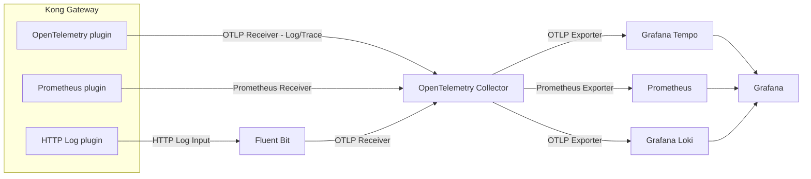

# Kong Plugin Examples

This is a sample configuration for experiencing Kong's plugins.

## Architecture

Observability platform have been build to see how plugins work.



## How to use?

Run this script.

```sh
docker compose up -d
```

You can access as follows.

| service      | endpoint                                                         |
| ------------ | ---------------------------------------------------------------- |
| Kong Manager | [http://localhost:8002](http://localhost:8002)                   |
| API          | [http://localhost:8000/v1/greet](http://localhost:8000/v1/greet) |
| Grafana      | [http://localhost:3000](http://localhost:3000)                   |

After that, Please configure the desired plugin settings using decK. For example,

```sh
deck gateway sync plugins/canary/fixed-percentage/kong.yml
```
